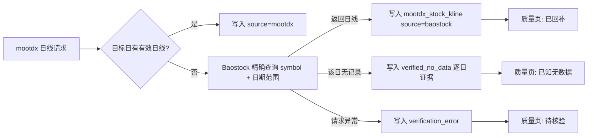

# Baostock 按需日线核验设计

## 目标

建立 Baostock 历史 K 线适配器，并在 mootdx 日线同步发现缺失时按需复查。Baostock 确认有数据则回补到 `mootdx_stock_kline`；确认无数据则保存逐日证据，将该缺口视为正常无交易；查询失败则保留待核验状态。

## 范围

- 第一阶段仅处理 `stock_kline_daily`，频率固定为 `daily`，口径固定为不复权。
- 不建立 Baostock 独立股票池，不主动定时拉取，不覆盖 mootdx 的目录与主同步职责。
- 不处理实时行情、分钟线、F10、财务或独立历史回补。

## 数据流

## 架构

### BaostockSource

新增 `src/data/baostock_source.py`，只负责 SDK 边界：加载依赖、登录/退出、项目代码与 Baostock 代码转换、日线请求、字段转换和源端错误转译。接口返回项目标准日线 DataFrame：

`date, open, high, low, close, volume, amount, symbol, tradestatus, is_st`

调用方通过显式会话上下文批量复用一次匿名登录，避免每个缺口重复登录。Baostock SDK 不存在或登录失败时，适配器抛出可审计的异常，不能把异常伪装成空数据。

### 核验与回补

`sync_mootdx_offline_data(... stock_kline_daily ...)` 在 mootdx 单标的请求未取得目标日有效行时，才调用核验器。核验器针对本次传入的目标日期或回补日期范围查询 Baostock，并逐日产生判定：

| 判定 | 条件 | 后续动作 |
| --- | --- | --- |
| `available` | 返回该日通过 OHLCV 校验且 `tradestatus=1` 的日线 | 写入 `mootdx_stock_kline`，`source='baostock'`。 |
| `no_data` | 请求成功但该日无记录，或仅有 `tradestatus=0` 的停牌占位行 | 写入逐日核验证据；不写 K 线。 |
| `error` | 登录、请求、字段转换或响应错误 | 写入错误证据；不归类为无交易。 |

原有 `mootdx_symbol_data_status` 继续保存源端可用性，但不再用一个“某天没有日线”的标的级 `no_data` 状态代表未来 30 天都无需请求。逐日缺口的真相以核验表为准。

### 存储与血缘

复用 `mootdx_stock_kline` 已有的 `source`、`ingested_at`、`raw_json` 字段，Baostock 回补行写 `source='baostock'`，原始响应写入 `raw_json`。不修改已有表主键。

新增 `mootdx_daily_gap_verifications`：

| 字段 | 含义 |
| --- | --- |
| `verified_at` | 本次核验时间，ReplacingMergeTree 版本列。 |
| `run_id` | 触发本次 mootdx 同步的运行 ID。 |
| `symbol`, `frequency`, `trade_date` | 核验主键，第一期频率为 `daily`。 |
| `verdict` | `available`、`no_data`、`error`。 |
| `source` | 固定 `baostock`。 |
| `details_json` | 请求范围、返回日期、字段、错误、耗时等证据。 |

表按 `(frequency, symbol, trade_date)` 去重保留最新核验，TTL 三年。它既是质量判定依据，也是后续 Baostock 管理页的审计来源。

## 质量页规则

日线质量服务读入最新的逐日核验结果，并覆盖原先只依据“前后交易日有 K 线”的推断：

- 区间每个交易日均为 `no_data`：`known_no_data`，显示“Baostock 已确认无交易记录”。
- 区间存在 `available` 但主表仍缺失：`repair_candidate`，显示“Baostock 确认有数据，待回补”。正常同步中这一状态应很短暂。
- 区间存在 `error` 或尚未触发核验：`needs_review`。
- 所有判定必须包含证据摘要；页面不再将单纯“前后有数据”作为建议回补的充分条件。

## 运行与失败策略

- 没有独立 DataOps 调度；调用发生在已有 mootdx 日线主同步、缺口核对或人工定向回补过程中。
- 不对 Baostock 做并行请求；同一次 mootdx 日线同步内复用一个会话，逐标的执行。
- 每个缺口只查询所需连续日期范围，避免新浪式全量历史回拉。
- Baostock 的空响应与异常必须分离记录；异常不阻塞其他标的，也不将结果写为 `no_data`。
- 在回补日前对 Baostock 行执行与 mootdx 相同的 OHLCV 有效性检查，非法行记作 `error` 证据。

## 依赖与可观测性

- 将 `baostock==0.9.3` 放入 `market` 可选依赖，使 `uv sync --extra market` 可复现安装。
- 同步审计的 `diagnostics.stock_kline_daily` 增加：核验请求数、`available/no_data/error` 数、Baostock 回补行数和失败样本。
- 复用现有 Mootdx 管理页与日线质量页显示审计；本阶段不新建独立 Baostock 定时任务页面。

## 验收标准

1. 没有安装 Baostock 时，日线同步记录核验错误且不会标记为无数据。
2. mootdx 目标日缺失、Baostock 有有效行时，主表写入 `source='baostock'` 的日线并记录 `available`。
3. mootdx 目标日缺失、Baostock 成功但无该日行时，写 `no_data` 逐日证据，质量页显示已知无数据。
4. Baostock 抛错时，写 `error` 证据，质量页保持待核验。
5. 现有 mootdx 正常日线不调用 Baostock。
