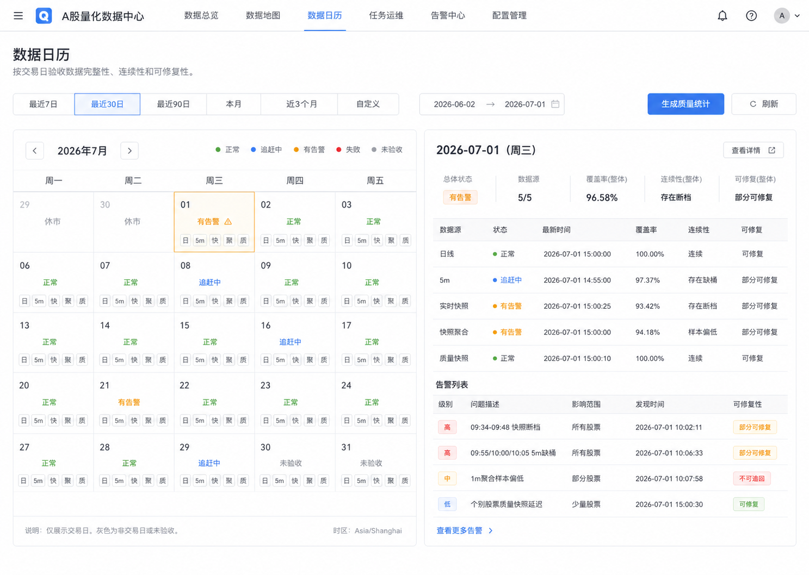
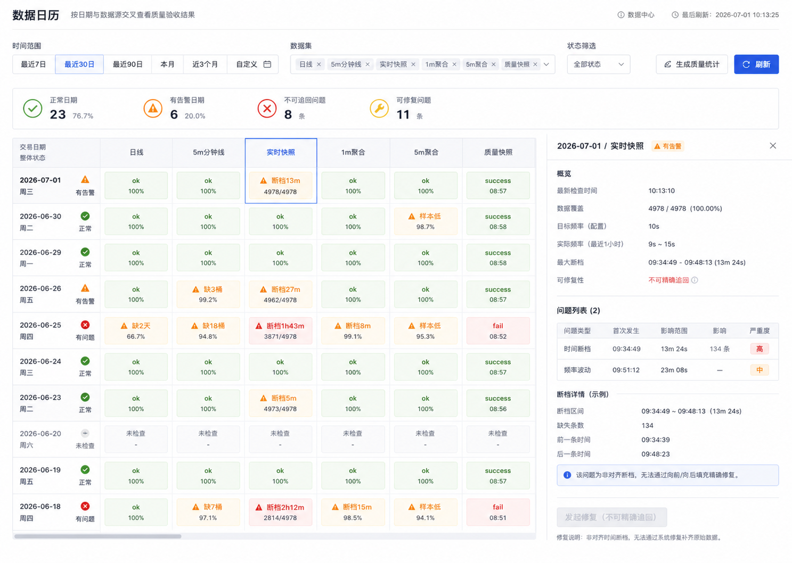
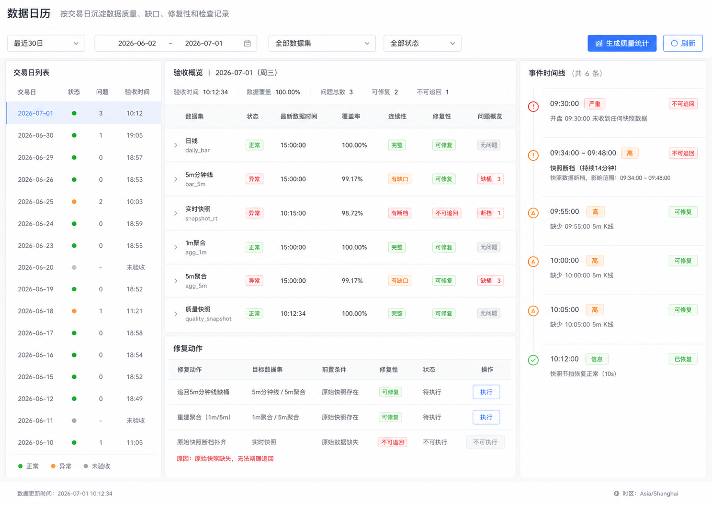

# 数据日历 UI 设计稿

## 目标

数据日历用于按交易日验收数据质量，回答：

- 某个交易日的数据是否完整、可信。
- 哪些数据源有缺口、断档、节拍不足或重复。
- 问题是否可修复，是否已经恢复。
- 未检查日期是否需要生成质量统计。

它不替代数据健康矩阵。健康矩阵回答“当前状态”，数据日历回答“按日期沉淀后的质量结果”。

## 设计约束

- 先不做“今日总控”，数据质量未稳定前不引入策略可用性判断。
- 时间范围必须可选，不固定为最近 30 个交易日。
- 保持当前数据中心的后台控制台风格：Element Plus 表格、标签、筛选器、展开详情、紧凑信息密度。
- 不做营销式页面，不做大面积装饰图形，不用低信息量卡片堆叠。
- 第一版聚焦核心链路：日线、5m 分钟线、实时快照、1m/5m 快照聚合、质量快照。

## 页面位置

数据中心建议排序：

1. 数据健康矩阵
2. 数据日历
3. 更新任务状态
4. 数据修复
5. 高级诊断

## 范围筛选

数据日历顶部提供时间范围筛选：

- 最近 7 个交易日
- 最近 30 个交易日，默认
- 最近 90 个交易日
- 本月
- 近 3 个月
- 自定义日期范围

已沉淀到 `data_quality_calendar` 的日期直接展示；未统计日期显示为“未检查”，提供“生成质量统计”入口，不在页面加载时自动大范围回算。

## 状态定义

- `ok`：数据完整、覆盖率达标、连续性达标、节拍达标。
- `catching_up`：数据落后但对应 runner 正在运行，预计可追回。
- `warning`：有缺口、断档、节拍不足、样本偏低或重复行，但系统仍可部分使用。
- `failed`：关键数据缺失或任务失败，影响该日数据可信度。
- `unchecked`：未生成该日质量统计。

## 日期详情字段

点击日期后，按数据源展示：

| 字段 | 说明 |
|---|---|
| 数据源 | 日线、5m、实时快照、1m 聚合、5m 聚合、质量快照 |
| 状态 | ok / catching_up / warning / failed / unchecked |
| 最新时间 | 该日最新数据时间 |
| 覆盖率 | 实际标的 / 预期标的 |
| 连续性 | 缺失桶、断档区间、最大断档 |
| 节拍 | 快照实际间隔 vs 目标间隔 |
| 样本质量 | 聚合桶 sample_count 是否足够 |
| 可修复 | 可修复 / 部分可修复 / 不可追回 |
| 问题摘要 | 缺失桶、断档时间段、重复行等 |
| 最近检查 | checked_at |

## 方案一：日历优先

特点：

- 左侧使用月历/交易日历，右侧显示选中日期详情。
- 最符合“日历”的直觉模型。
- 适合按天巡检、历史回看和业务人员理解。

优点：

- 日期状态直观。
- 今天、非交易日、未检查日期容易区分。
- 适合和现有数据中心作为一个独立模块并排展示。

不足：

- 数据源较多时，单个日期格子承载的信息有限。
- 横向比较“某个数据源跨日期质量”不够直接。

适用场景：

- 第一眼看某天是否异常。
- 点击某天后做详细检查。

## 方案二：热力矩阵优先

特点：

- 用“日期 × 数据源”的矩阵展示质量状态。
- 每个单元格直接显示状态和核心指标，例如 `100%`、`缺3桶`、`断档13m`、`样本低`、`未检查`。
- 右侧抽屉查看选中单元格详情。

优点：

- 最适合快速发现哪一天、哪个数据源有问题。
- 横向看单日质量，纵向看某数据源历史稳定性。
- 后续接入更多数据源时扩展性好。
- 能明显避免“健康矩阵显示 100%，但某日有断档”的误判。

不足：

- 初看比月历更偏运维，需要用户理解矩阵含义。
- 需要控制列宽和状态文案，否则容易拥挤。

适用场景：

- 数据运维巡检。
- 快速定位历史缺口。
- 对比多个交易日的数据稳定性。

推荐作为第一版主方向。

## 方案三：运维台优先

特点：

- 左侧交易日列表，中间验收明细，右侧事件时间线。
- 重点呈现某一天的问题发生过程：开盘无快照、快照断档、5m 缺桶、节拍恢复等。
- 底部提供修复动作列表。

优点：

- 最适合排查单日事故。
- “可修复 / 不可追回 / 已恢复”的表达最清晰。
- 对今天这种盘中同步机制调整导致的断档很友好。

不足：

- 横向比较多个日期不如热力矩阵。
- 如果作为主视图，日历感较弱。

适用场景：

- 已经发现某天异常，需要详细定位。
- 数据修复前后的操作确认。

## 推荐方案

第一版建议采用“方案二：热力矩阵优先”，并吸收方案三的右侧详情能力。

推荐结构：

- 顶部：范围筛选、数据源筛选、状态筛选、生成质量统计、刷新。
- 主体：日期 × 数据源热力矩阵。
- 右侧：选中日期或选中单元格详情。
- 详情中保留事件时间线和修复性说明。

原因：

- 当前系统最大问题不是“看不到今天”，而是“看不到某天某数据源的历史质量缺口”。
- 热力矩阵最能直接暴露开盘缺口、快照断档、5m 缺桶、聚合样本不足。
- 以后接入更多数据源时，不需要重做页面结构。

## 第一版验收标准

完成后应能清楚看到：

- 哪些交易日未检查。
- 哪些交易日存在数据问题。
- 哪个数据源导致该日异常。
- 今天是否存在开盘缺口。
- 快照是否按目标节拍采样。
- 最大断档发生在哪个时间段。
- 5m 分钟线缺哪些桶。
- 聚合桶是否缺失，样本数是否偏低。
- 哪些问题可修复，哪些不可追回。

## 后续实施边界

第一版实现：

- `data_quality_calendar` 表。
- 查询 API。
- 手动生成质量统计 API。
- 数据中心新增数据日历模块。
- 支持日期范围选择。
- 支持核心链路数据源。

暂不实现：

- 策略可用性判断。
- 基金数据质量日历。
- 模型样本质量日历。
- 大范围历史自动回算。
- 自动修复编排。
